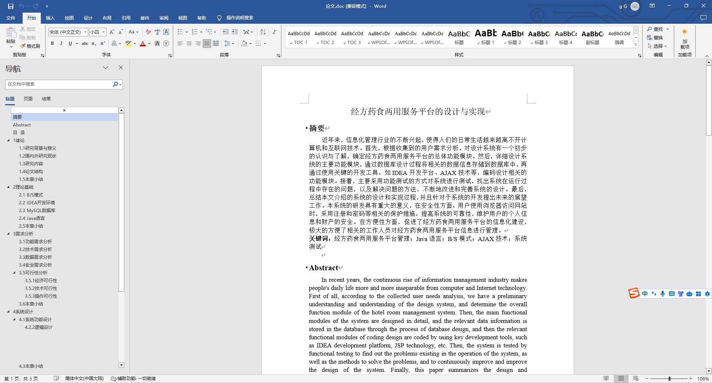
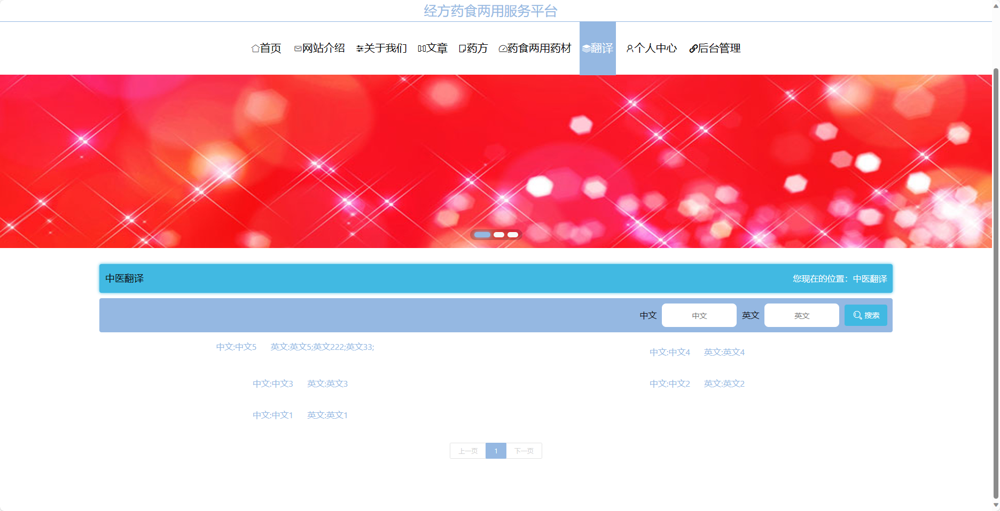
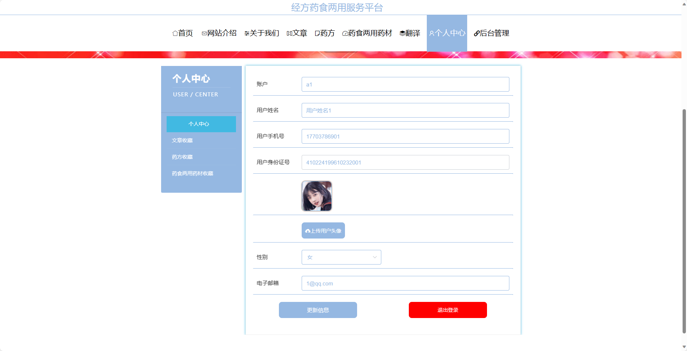
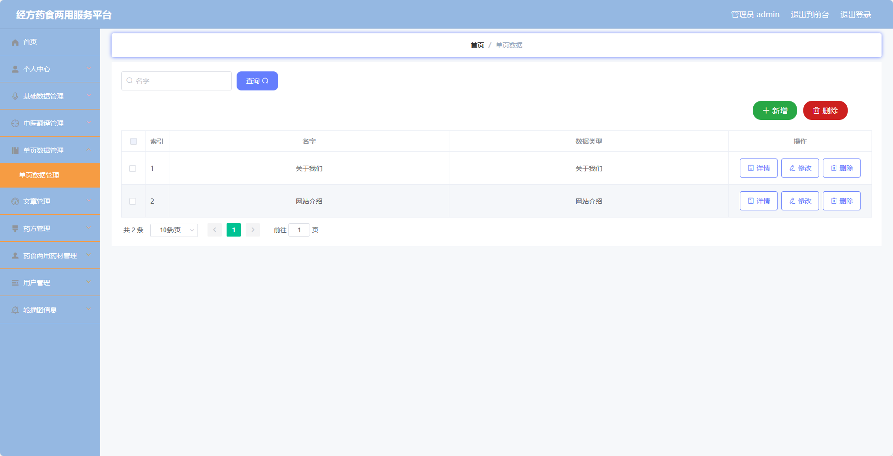
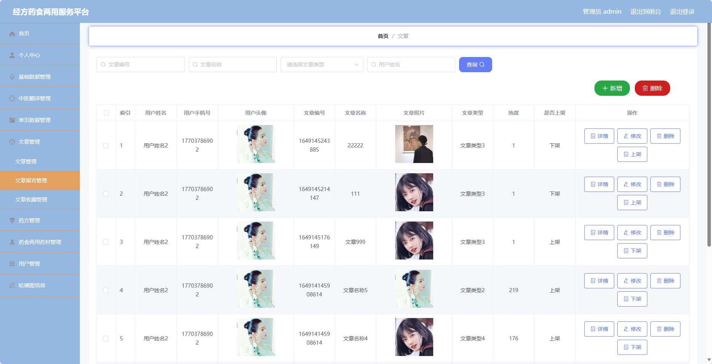
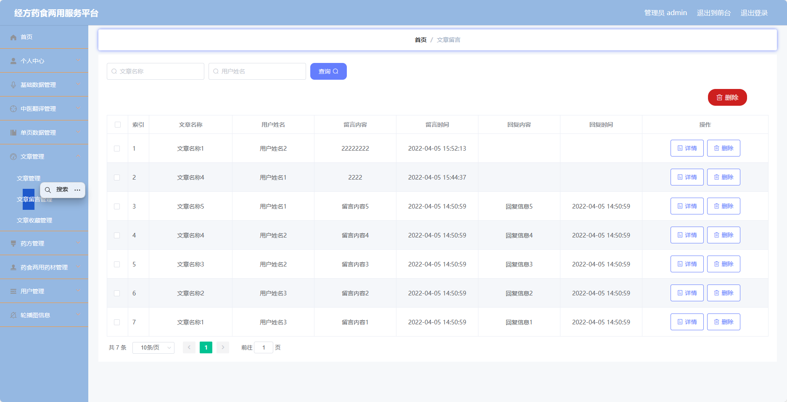

## 基于SpringBoot的经方药食两用服务平台(程序+报告)

###  获取sql数据库文件: 从戎源码网 (https://armycodes.com/) QQ: 386869957 QQ群: 377586148
###  所有系统地址: (https://github.com/YuLin-Coder/AllProjectCatalog) 
###  所有项目以及源代码本人均调试运行无问题 可支持远程安装部署调试、定制修改、代码讲解

## 项目介绍
基于SpringBoot的经方药食两用服务平台，系统包含两种角色：管理员、用户,系统分为前台和后台两大模块，主要功能如下。

### 【管理员】:
- 个人中心：管理员可以管理个人信息，包括修改个人资料。
- 基础数据管理：管理员可以管理系统的基础数据，包括用户信息、角色权限等。
- 中医翻译管理：管理员可以管理中医术语、药材名称等的翻译信息，包括添加、编辑、删除翻译等操作。
- 单页数据管理：管理员可以管理网站的单页数据，包括网站介绍、关于我们等内容的编辑和更新。
- 文章管理：管理员可以管理文章信息，包括发布、编辑、删除文章等操作。
- 药方管理：管理员可以管理药方信息，包括添加、编辑、删除药方等操作。
- 药食两用药材管理：管理员可以管理药食两用药材信息，包括添加、编辑、删除药材等操作。
- 用户管理：管理员可以管理用户信息，包括添加、编辑、删除用户等操作。
- 轮播图信息：管理员可以管理网站首页的轮播图信息，包括添加、编辑、删除轮播图等操作。

### 【用户】:
- 个人中心：用户可以管理个人信息，包括修改个人资料、查看收藏的文章和药方等。
- 中医翻译管理：管理员可以管理中医术语、药材名称等的翻译信息，包括添加、编辑、删除翻译等操作。
- 文章管理：管理员可以管理文章信息，包括发布、编辑、删除文章等操作。
- 药方管理：管理员可以管理药方信息，包括添加、编辑、删除药方等操作。
- 药食两用药材管理：管理员可以管理药食两用药材信息，包括添加、编辑、删除药材等操作。

### 【前台】:
- 首页：展示网站的核心内容和功能入口。
- 网站介绍：介绍经方药食两用服务平台的宗旨、使命和特色。
- 关于我们：展示平台团队的背景和成员信息。
- 文章：提供中医药相关的文章。
- 药方：提供中医药方的查询和分享。
- 药食两用药材：介绍常见的药食两用药材及其功效、用法等信息。
- 翻译：提供中医术语、药材名称等的中英文翻译服务。
- 个人中心：用户可以管理个人信息。

## 项目技术
- 编程语言：Java
- 数据库：MySQL
- 项目管理工具：Maven
- 前端技术：HTML、CSS、JavaScript、Jquery、Vue
- 后端技术：Spring、SpringMVC、MyBatis

## 运行环境
- JDK版本：JDK1.8及以上
- 开发工具：IDEA、Ecplise、Myecplise都可以
- 数据库: MySQL5.7及以上
- Maven：maven3.0及以上
- Node：14.14.0及以上

## 运行截图

